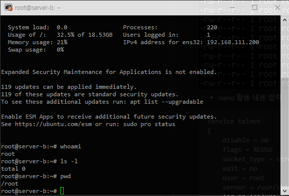

## toyprojects
심심할때 만들어보는 토이프로젝트

## VMWare 활용 리눅스 텔넷/SSH/XRDP 서버 구현해보기
- TelNet 서버 구현 [SOURCE](https://github.com/Owl-jun/ubuntu/tree/main/ToyProject/Telnet%2C%20SSH%2C%20XRDP)

## C# WinForm 활용 토이프로젝트
- 리눅스 명령어 연습 앱 [SOURCE](https://github.com/Owl-jun/iot-winapp-2025/tree/main/toyproject/WinFormProject)
  
https://github.com/user-attachments/assets/3ea989e3-3905-4050-a9d3-fe86732419c4

- 실제 bash 를 실행 한게 아니고, 명령어를 파일로(.sh) 작성하여 wsl.exe -> 명령어.sh 실행시키는 방식 이기에 동작하지 않는 명령어가 많음.
- 제공되는 기능 : History , Tutorial , 폰트 사이즈 조절
- 개인적인 우분투 리눅스 학습 도중 이런게 있으면 환경설정 없이 편하게 할 수 있겠다 싶어 제작하게 됨.

## pygame 활용 토이프로젝트 모음집

- 10의 배수 찾기 (py96_pygame_findTen.py)

  - 제작 기간 : 1일 , 네이버 치지직 방송에서 잠시 유행하던 마우스 드래그로 10 만들기 게임을 보고 만들어 보고싶어서 만듦

https://github.com/user-attachments/assets/5090a229-8e0e-4df2-8ad0-9ca6bf11a049

## tkinter 활용 토이프로젝트 모음집

- 학생정보 관리 DB연동 프로그램 [SOURCE](https://github.com/Owl-jun/iot-database-2025/blob/main/day09/students_regapp.py)

  - pymysql을 통해 db연동 학습
  - DB CRUD 기능 + 검색 기능 구현
    
https://github.com/user-attachments/assets/431258f9-1c7e-493c-b77a-7e3ea8782b75

- 숫자 퍼즐 (py97_tkinter_NumberPuzzle.py)

  - 제작 기간 : 5시간 , 숫자버튼의 이동 로직 구현에 애를 먹고 시간이 많이 소요됨

https://github.com/user-attachments/assets/64171d9d-cd96-4a59-b229-6d2f3193a358

- 두더지 잡기 게임 (py98_tkinter_whackAMole.py)

  - 제작 기간 : 2시간 , tkinter 심층 학습을 위해 제작
      
https://github.com/user-attachments/assets/36a64d2c-e454-49f4-8842-a404a0a237b5

- 색칠놀이 (py99_tkinter_changeColor.py)
  
  - 제작 기간 : 1시간 , tkinter 튜토리얼 학습 중 제작

https://github.com/user-attachments/assets/d0117e0f-34ca-4816-a178-cc7ad7db17a0

